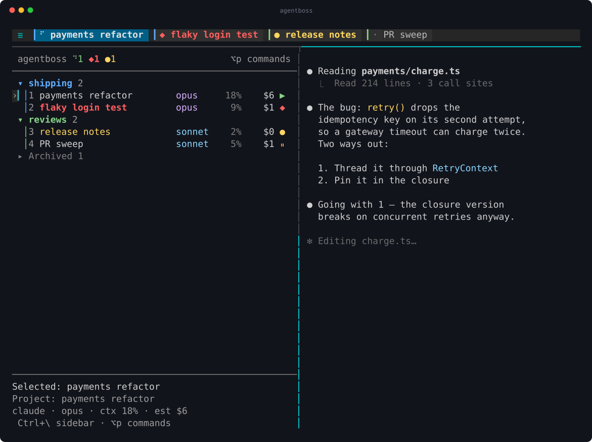
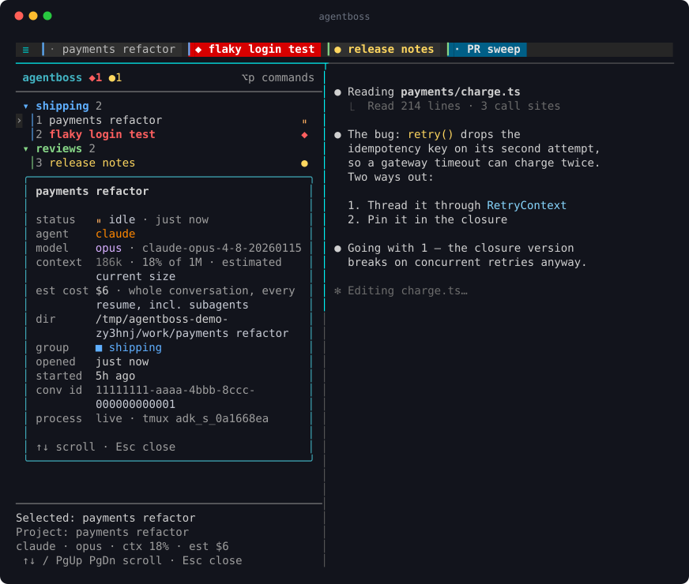
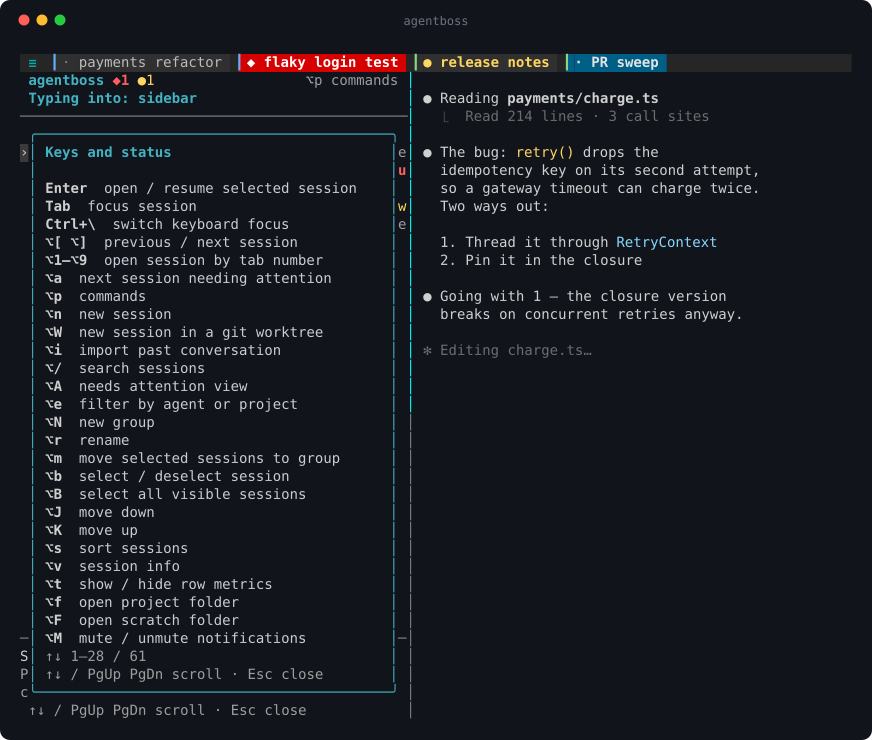

<div align="center">

# agentboss

**One screen for every coding-agent session you have running — Claude Code and Codex.**

[](LICENSE)
[](.github/workflows/ci.yml)




</div>

You keep more agent sessions alive than you can hold in your head — a refactor
mid-flight, a flaky test being chased, a docs sweep, a follow-up from last month.
agentboss puts them on one screen and keeps them running: a sidebar of every
session grouped your way, tabs for the ones that are open, and the live agent
filling the rest. Close the terminal, reboot, come back tomorrow — the desk is
where you left it.

---

## Why

Three things go wrong once you run agents in bulk, and a multiplexer alone fixes
none of them.

**You can't tell which session wants you.** agentboss reads each agent's own
events, so a session that just finished, or is blocked on a permission prompt,
says so in the sidebar, blinks in the tab bar, and can raise a desktop
notification that jumps you straight there. You look at the two that need you,
not all thirty.

**Sessions outlive terminals.** Every session runs in its own tmux session and
everything needed to revive it is on disk, so closing a terminal — or rebooting —
costs nothing. A dormant session comes back with one keypress, resumed in the
right folder by the right agent.

**Thirty sessions need structure.** Colored groups, drag to reorder and regroup,
search, sorting, an `old` shelf, and per-session model, context and cost — so a
desk with a month of history stays navigable.

## Install

```sh
go install github.com/tallu-wonder/agentboss@latest
```

— or grab a prebuilt binary from the [latest release](https://github.com/tallu-wonder/agentboss/releases/latest)
(macOS and Linux, arm64 and amd64) and put it on your `PATH`.

Needs **tmux ≥ 3.2** and at least one of Claude Code / Codex. Run `agentboss`
from anywhere: outside tmux it wraps itself, inside tmux it jumps to the manager.
On macOS, `brew install terminal-notifier` makes notifications clickable.

## A tour

Press `opt+n`, pick a folder, pick an agent — that's a session. It gets a tab, a row,
and a status glyph that tracks it: `⠴ working`, `◆ needs you`, `● finished since
you looked`, `· idle`, `○ dormant`. Group it, drag it, rename it. Walk away and
the agents keep going.

<table>
<tr>
<td width="50%"></td>
<td width="50%"></td>
</tr>
<tr>
<td align="center"><code>opt+v</code> — everything about one session</td>
<td align="center"><code>opt+?</code> — every key, without leaving the desk</td>
</tr>
</table>

## Two agents, one desk

Each session belongs to an agent, and agentboss speaks both natively rather than
reducing them to a lowest common denominator.

| | Claude Code | Codex |
| --- | --- | --- |
| Wake a dormant session | `claude --resume <id>` | `codex resume <id>` |
| Live status | Claude Code **hooks** | transcript events; optionally its **notify** hook |
| Learning the conversation ID | announced by the `SessionStart` hook | adopted by folder + start time, since Codex reveals it only at turn end |
| Name | the session's own name (`/rename`) | the thread name in Codex's session index |
| Context size | last turn's tokens vs a per-model estimate | last turn's prompt vs the **real** window Codex reports |
| After a compaction | drops immediately, from the compact record | drops on the next turn |
| Estimated cost | yes, per-model | not shown — no trustworthy price table |
| Per-session scratch folder | yes — `opt+F` opens it | none; Codex writes only its transcript |

Mixed desks are the point: group a Claude session next to a Codex one, sort them
together, switch with the same keys.

## One repo, several agents

Two ways to parallelize that don't step on each other:

- **`opt+W` — a session in a fresh git worktree.** You name it; the worktree lands
  at `<repo-parent>/.worktrees/<repo>-<name>` on a new branch `<name>`
  (an existing branch of that name is checked out instead). Each agent gets its
  own working copy, so nothing they edit collides. agentboss never deletes a
  worktree — when you're done, `git worktree remove` it.
- **right-click → fork the conversation.** A NEW session whose conversation
  starts as a copy of the original — same folder, same context, two approaches
  from the same point. Uses each agent's own mechanism (`claude --resume
  --fork-session`, `codex fork`).

## Keys

**Every action key is an `opt`/`alt` chord, and a bare letter does nothing —
by design.** Sooner or later you will type prose at the sidebar believing an
agent has the keyboard, and "1. first do this" must not be able to switch
sessions, close tabs, or start anything. Only keys that can't appear in prose
stay plain: `enter`, `tab`, `esc`, arrows, paging, and the mouse.

Three chords work **from anywhere on the desk, inside an agent included** —
tmux intercepts them before the agent sees them, and your keyboard stays where
it is: `opt+[` / `opt+]` (previous / next), `opt+1`…`opt+9` (n-th open
session, tab order), `opt+a` (next session needing you).

| Key | Action |
| --- | --- |
| `enter` / click | open in the viewport (wakes dormant sessions; asks first for `old` ones) |
| `opt+o` | open but keep focus in the sidebar |
| `ctrl+\` | sidebar ⇄ session; from another tmux session, jump to the desk |
| `opt+[` `opt+]`, tab clicks | previous / next session — anywhere |
| `opt+1`–`opt+9` | the n-th **open** session — anywhere, same order as the tabs |
| `opt+a` | next session needing attention — anywhere |
| `opt+/` | search (substring on name/folder/group, fuzzy on name) |
| `opt+n` · `opt+i` | new session · import a past conversation (both agents) |
| `opt+W` | new session in a fresh **git worktree** of a repo |
| `opt+N` · `opt+r` · `opt+m` | new group · rename · move to group |
| `opt+J` `opt+K`, drag | reorder rows and groups, across groups or onto a header |
| `opt+s` · `opt+c` | sort · pick a group's color |
| `opt+v` · `opt+?` | session info · keys |
| `opt+M` | mute / unmute desktop notifications |
| `opt+f` · `opt+F` | open the session's folder · the agent's own scratch folder |
| right-click | context menu, on a row or a tab, with single-letter shortcuts (it's modal — prose can't reach it) |
| `opt+space` / `opt+h` | collapse or expand a group (`enter` on the header too) |
| `opt+<` `opt+>`, drag divider | sidebar width |
| `opt+z` · `opt+x` | close the tab (session stays, asks first) · close to `old`; on an old session, delete |
| `opt+u` | reopen what you just closed or shelved |
| `opt+q` | quit the manager (asks first) — every agent keeps running |

On macOS, Option only sends Alt if the terminal says so — Ghostty needs
`macos-option-as-alt = true`, iTerm2 "Esc+" for the left Option key. On Linux,
read `opt` as `alt`. Terminals that use some of these chords themselves can
move the cycle keys with `AGENTBOSS_PREV_KEY` / `AGENTBOSS_NEXT_KEY`.

Mouse: click a row to open it, drag rows and headers to reorder and regroup,
click tabs to switch, drag tabs to reorder, middle-click to close, right-click
for a menu, wheel to scroll, and click into the session to talk to the agent.
When more tabs are open than fit, the strip follows the active one and the
rest collapse into `‹N` / `N›` chips — click a chip to step that way; it turns
red when a hidden session needs you.

## How it works

- **tmux is the supervisor.** One tmux session per agent, so nothing dies with a
  terminal or a manager restart. The viewport is a nested tmux client, so each
  agent's own UI runs at full fidelity — no wrapper, no lag.
- **Status comes from the agents.** Claude Code hooks and Codex's transcript feed
  a small status file per session; the newest signal wins.
- **The desk is a file.** Groups, order, folders, agent kind and conversation IDs
  live in `~/.agentboss/state.json`, written atomically by the one manager that
  holds the lock.
- **Nothing irreversible is quiet.** Deleting, shelving, closing a tab, quitting
  the manager and reviving a shelved session all ask first — in a popup in the
  middle of the sidebar, not a line in the footer you press past. Every desk key
  is a single letter, and sooner or later you will type one believing an agent
  had focus; the ones that could cost you something are the ones that ask.
- **A crash is survivable.** If the sidebar panics it writes
  `~/.agentboss/crash.log`, restarts itself and says so. Your agents never notice.

## Configuration

All optional; agentboss works with none of it.

| Variable | Default | Meaning |
| --- | --- | --- |
| `AGENTBOSS_HOME` | `~/.agentboss` | desk, status files, lock |
| `AGENTBOSS_CLAUDE_CMD` / `AGENTBOSS_CODEX_CMD` | from `PATH` | the agent binaries |
| `AGENTBOSS_RETURN_KEY` | `C-\` | the sidebar ⇄ session key, in tmux syntax |
| `AGENTBOSS_PREV_KEY` / `AGENTBOSS_NEXT_KEY` | `M-[` / `M-]` | cycle sessions from anywhere, agent panes included |
| `AGENTBOSS_NOTIFY` | unset | `needsyou` for blocking requests only, `all`, or `off` |
| `AGENTBOSS_OPEN_CMD` | `open` / `xdg-open` | what `f` and `F` open folders with (`code -n` works) |
| `AGENTBOSS_NO_HOOKS` | unset | set to anything to never touch Claude Code's `settings.json` |
| `AGENTBOSS_PRICING` | `~/.agentboss/pricing.json` | override the cost estimate's rates |
| `AGENTBOSS_WORKTREE_DIR` | `<repo-parent>/.worktrees` | where `W` puts new git worktrees |
| `AGENTBOSS_CODEX_HOME` | `~/.codex` | where Codex keeps its config and sessions |

Rates drift, so the cost estimate is overridable — `{"opus": [5, 25], "sonnet":
[3, 15]}`, USD per million tokens, input then output. Families you don't list keep
their built-in rates.

## Reading the numbers

The token figure is the context **in use right now** — the size of the last turn,
not a running total, so it falls after a `/compact`. Codex reports its real
window, so its percentage is exact; Claude's is inferred per model family.

The cost figure is the estimated price of the **whole conversation**: every turn,
across every resume, subagents included. That is deliberately a wider window than
Claude Code's own `/usage`, which covers only the current process — so a
long-lived session can read `$478` here and `$4.00` there without either being
wrong.

## Notifications

When a session starts asking for you, agentboss posts a desktop notification;
clicking it raises the terminal, switches the viewport to that session and clears
the alert. The session already in the viewport stays silent, and `M` mutes the
rest while you work at the desk (the header shows 🔇, and it persists).

Muting is a toggle rather than something clever, because whether you are *looking*
at the desk cannot be detected: terminals report focus per window, so another tab
of the same terminal is indistinguishable from the desk itself. For the same
reason a click can raise the terminal but not switch to its tab.

## Codex notify chaining

Codex allows a **single** `notify` program and other tools manage that slot too —
two `notify` keys are a duplicate TOML key, which stops Codex from starting at
all. So agentboss never edits it unattended: Codex status comes from the
transcript by default, and chaining is opt-in.

```sh
agentboss install-codex-notify           # refuses if another program owns the slot
agentboss install-codex-notify --force   # chain in front of it anyway
agentboss uninstall-codex-notify         # restore what was there
```

When it does chain, it records the program it displaced and forwards every event
to it unchanged. `~/.codex/config.toml` is backed up first, and only the `notify`
line is rewritten.

## What it touches, and what it trusts

- **Files.** `~/.agentboss/` at `0700`. It adds its hook entries to Claude Code's
  `settings.json`, keeping a pristine copy at `settings.json.agentboss-backup`,
  rewriting only its own entries, and refusing a file it cannot parse.
  `AGENTBOSS_NO_HOOKS=1` opts out entirely.
- **Agent text is untrusted.** Names, summaries, todos, model ids, hook messages
  and git branches all come from transcripts, prompts or repositories. Each is
  reduced to printable single-line text before it is stored or displayed, so a
  name cannot smuggle escape sequences onto your screen, and `#` is escaped
  before anything reaches tmux, where `#(command)` would otherwise execute.
- **Ids are validated before they become paths** or tmux session names, so a
  hand-edited desk file cannot write outside its own directory.
- **Nothing leaves your machine.** No telemetry, no network calls. The only
  processes it starts are tmux, your agents, `git` for branch status, and the
  notifier and file manager you configured.

## Notes

- Inside agentboss panes the tmux prefix is `ctrl+q`, so the agents' own keys pass
  through untouched.
- **shift+enter inserts a newline in both agents.** tmux forwards modified keys
  only to apps that ask the classic way; Codex asks with the kitty protocol,
  which tmux does not recognize, so the chord arrived as a bare carriage return
  and submitted the prompt. agentboss binds `S-Enter` to send `ESC CR`, which
  both agents accept as a newline.
- **Selecting text copies to the system clipboard.** tmux's default
  `set-clipboard external` discards clipboard writes from applications, and
  inside the viewport the inner tmux client *is* an application, so a copy made
  in a pane never reached the terminal. agentboss sets `set-clipboard on`.
- **Links are not clickable**, and that is not fixable here: while tmux owns the
  mouse — which is what makes tab clicks and drag-to-reorder work — the terminal
  never sees the click, so its own URL handling never fires. Toggle mouse
  reporting off for a moment if you need one (Ghostty: `toggle_mouse_reporting`).
- Renaming inside the agent always wins over a name typed on the desk — it is the
  newer intent. Right-click → *use the agent's name* releases a name you pinned.
- A resumed Codex thread keeps its ID but starts a new transcript file, so
  agentboss resolves a thread to its newest one rather than trusting file names.
- Sessions started outside agentboss aren't tracked; use `n` or `i`.

## Development

```sh
go test ./...                       # unit tests, fast
go test -tags e2e ./internal/e2e/   # drives a real desk in a private tmux server
```

The end-to-end suite starts a real manager with stub agents and asserts the
things that only break in situ — tabs, digit keys, confirmations, notifications,
escaping. CI runs both on Linux and macOS, alongside `go vet`, `staticcheck` and
`govulncheck`.

The screenshots above are the real TUI: captured from a live desk with
`tmux capture-pane -e` and rendered by [`docs/ansi2svg.py`](docs/ansi2svg.py), so
they cannot drift into being mock-ups.

Linux builds and passes both suites in CI, but the desk has only been used in
anger on macOS; rough edges there are likely and reports are welcome.

## License

MIT — see [LICENSE](LICENSE).
