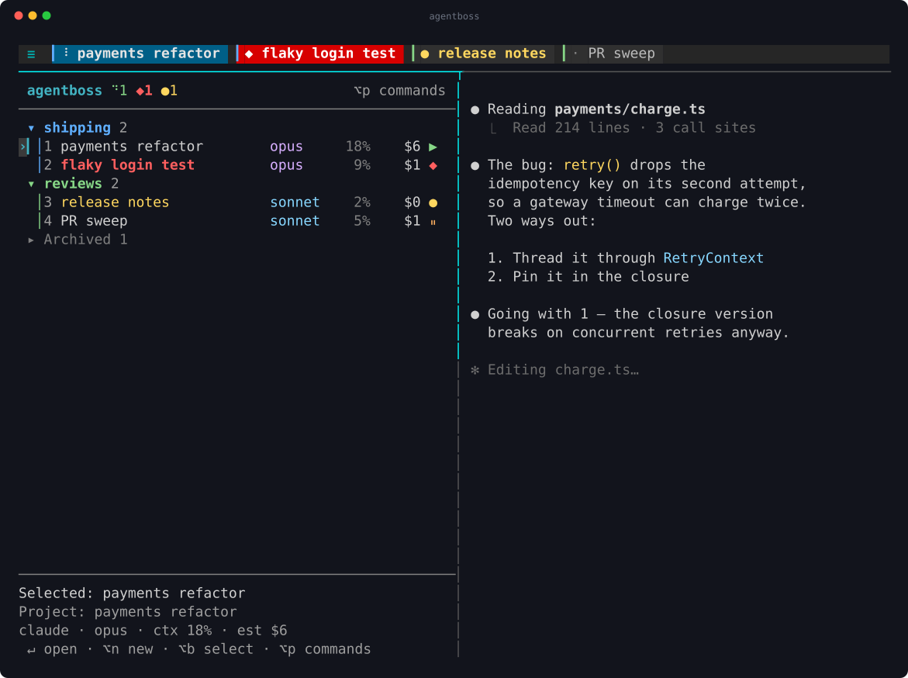
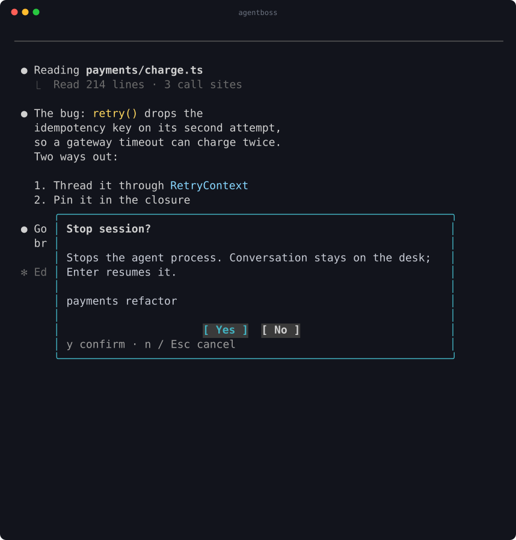
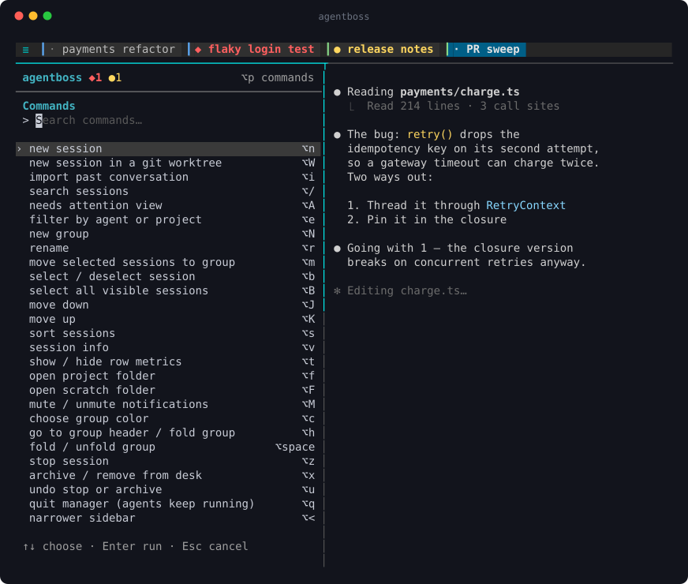
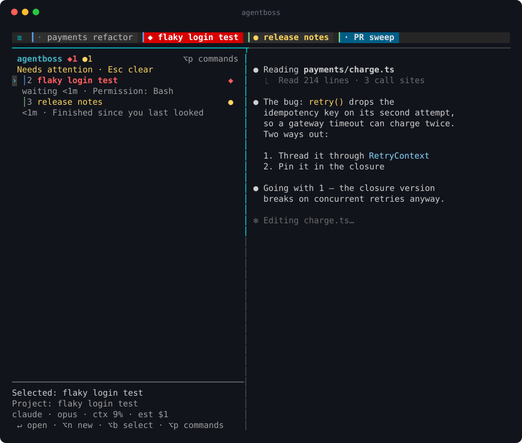

# Screenshots

These images show the running agentboss UI with fabricated sessions and stub
agents. The README displays them at full width. Each image links to its SVG
original, which stays sharp when enlarged.

## Focus

The cyan top border marks the pane receiving keyboard input. Clicking a pane or
pressing `ctrl+\` moves focus. The selected row and displayed session remain
marked, so you can distinguish selection from keyboard focus.

**Agent focused:** type directly into the agent; the sidebar header and selection
are subdued. Optional row metrics are enabled with `opt+t` in this example.

<a href="desk.svg"></a>

**Sidebar focused:** the border, header, and selected row brighten together.

<a href="sidebar.svg"></a>

## Dialogs

Confirmations, session info, and help open over the pane that triggered them.
Its focus border dims while the dialog is open, and focus returns there when
the dialog closes. These close-ups include the agent pane behind each dialog.

**Confirmations:** click **Yes** or **No**; `y` confirms and `n` / Escape cancels.
Enter never approves a confirmation. The buttons stay visible while long
messages scroll.

<a href="confirm.svg"></a>

**Session info (`opt+v`):** model, context, estimated cost, folder, and process.

<a href="info.svg"></a>

**Help (`opt+?`):** scroll with arrows or Page Up / Page Down; Escape closes it.

<a href="keys.svg"></a>

## Commands and attention

**Command palette (`opt+p`):** search commands and see their shortcuts.

<a href="commands.svg"></a>

**Attention queue (`opt+A`):** blocking requests first, followed by completed work.

<a href="attention.svg"></a>

## Regenerate

From the repository root, with Go, tmux, and Python 3 installed:

```sh
bash docs/demo.sh
```

The script builds the current checkout, starts a private tmux server with
fabricated transcripts, and drives real keyboard actions. It writes seven SVGs
in `docs/` and removes its temporary server and files on exit. Existing desks and
agent processes are outside the demo server.

| Images | Capture | SVG size |
| --- | --- | --- |
| `desk.svg`, `sidebar.svg`, `commands.svg`, `attention.svg` | 104 × 33 terminal cells | 1171 × 874 pixels |
| `info.svg`, `keys.svg`, `confirm.svg` | Agent pane close-up from a 132-column desk | Based on the pane's live geometry |

The renderer uses 18-pixel text on a 10.8 × 24-pixel cell grid. ANSI colors and
terminal-cell positions are preserved, including in cropped views. Dialog
screenshots are captured with focus in the agent pane so they show the placement
and focus behavior readers get from desk-wide shortcuts.

For a manual capture, use a tmux client pane showing the entire desk. A capture
of the sidebar alone does not include the tab bar or tmux popup dialogs.

```sh
tmux capture-pane -p -e -t '<client-pane-id>' > /tmp/desk.ansi
python3 docs/ansi2svg.py /tmp/desk.ansi /tmp/desk.svg agentboss
```

To crop to a feature, pass `--crop LEFT TOP WIDTH HEIGHT` in terminal cells,
using zero-based coordinates. For example:

```sh
python3 docs/ansi2svg.py /tmp/desk.ansi /tmp/detail.svg agentboss --crop 57 1 75 34
```

Before committing, inspect the images at README width and open the originals.
Check that dialog titles and buttons are visible, focus matches the caption,
and metrics and status colors remain legible.
